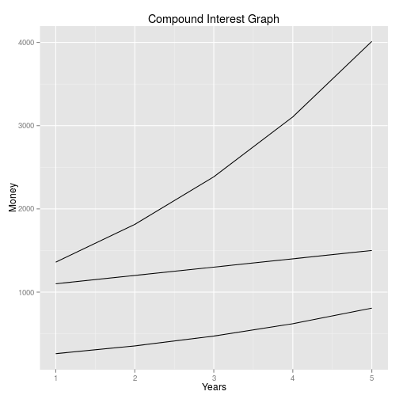

Coursera Developing Data Products Project:  Compound Interest Calculator
========================================================
author: Sanjay Meena
date: Sun Sep 27 13:42:34 2015


Objective
========================================================
This presentation is for the course project geared towards understanding of following conncepts

- [Shiny](http://shiny.rstudio.com/) to build data products applications
- **R-Presentation** or [slidify](http://slidify.org/) to create data products related presentations


Application
========================================================

- **“The most powerful force in the universe is compound interest”** – Albert Einstein
- Use this calculator to determine how much your money can grow using the power of compound interest.
- You can use the application : [Here](https://sanjaymeena.shinyapps.io/compound_interest_calculator) 
- Source code for the project is available on [Github](https://github.com/sanjaymeena/developing-data-products/tree/master/compound_interest_calculator)


Results on some Input data
========================================================

 
***

```
Total years invested :  5  
Total amount invested :  1500 $
Interest rate :  26 %
Total interest earned:  2512.642 $
Final Amount :  4012.642 $
```

Images of the App
========================================================


